# NoBC OS — Data-Flow & Architecture Reference

**Date:** 2026-06-16
**Author:** Apex (engineering lead), synthesizing 6 parallel read-only tonone crawls (flux ×3, spine ×2, lens ×1) of the canonical `main` checkout.
**Method:** read-only. Code is ground truth; where a spec doc (`CLAUDE.md`, `_context/*`) conflicts with code, the code wins and the conflict is called out. file:line citations throughout. No architecture proposed — this maps, explains, and flags.

> This is the reference document for turning NoBC OS from Tenant Zero into a multi-tenant SaaS. It is written so a non-author can understand the system without reading the code.

---

## Executive summary — the answer to the central question

**Can we cleanly separate a real-NoBC workspace from a demo/showcase workspace, and is the tenancy model production-ready?** **Yes, with a small, well-defined setup — the cleanest path is to leave the demo data where it is and stand up a brand-new, empty Clerk org as the real-NoBC workspace.** The workspace model is genuinely multi-tenant: 50 of 53 tables carry an indexed `workspaceId`, every tenant query derives that id from the server-side session (never from client input), and a second Clerk org auto-provisions a fully isolated workspace on first operator login (`lib/auth.ts:5-56`) — no cross-tenant leak was found at the query layer. The catch is that **today there is exactly one workspace and all of the "demo data made to look real" lives inside it** (`prisma/seed-demo.ts:4` — "Seeds the NoBC workspace... never deletes"), so real and demo are not separated yet; separation is achieved by the org boundary, not by scrubbing rows. Two mandatory pre-steps gate this: set `APPLY_DEFAULT_WORKSPACE_ID` to the workspace that should receive slug-less `/apply` submissions (otherwise the public form silently routes to the oldest workspace — `app/api/apply/membership/route.ts:27`), and give the new org a slug **other than `nobc`** (a same-slug org would inherit the existing workspace via the reconcile-by-slug branch — `lib/auth.ts:43-51`). There is **no staging/sandbox environment** — one Neon database, one Vercel deploy; "sandbox" is only ever a workspace inside production.

---

## Section 1 — Workspace / tenancy model  *(highest priority)*

### 1.1 How a workspace is represented
`Workspace` (`prisma/schema.prisma:12-86`) is the tenant root, 1:1 with a Clerk Organization:
- `clerkOrgId String @unique` (L14) — the binding to Clerk; one org ⇄ one workspace.
- `slug String @unique` (L16); white-label fields (`logoUrl`, `primaryColor`, `contactEmail`, tier display names), `aiModel String?` (operator-chosen Claude model for chat; **application scoring stays hard-locked to `claude-sonnet-4-20250514` in code**), `svixAppId String?`, `storageBytes`.
- **50 of 53 models carry `workspaceId`** (indexed / part of a composite unique): WorkspaceMember, EmailTemplate, PlatformSetting, ContactSource, Member, MemberPsychographics, FieldDefinition, Application, Event, EventWorkflow, EventCustomQuestion, RSVP, Ticket, Payment, WaitlistEntry, AuditEvent, AgentConversation, RedList, WatchList, QuestionDefinition, ApplicationTemplate, EventFlowTemplate, IntelligenceInsight, SavedReport, EventSeries, SeriesSponsor, TicketTier, TicketHold, Order, AccessToken, PromoCode, PromoRedemption, Tag, EntityTag, SponsorBrandProfile, RecapSnapshot, GeneratedAsset, SurveyResponse, OperatorComment, OperatorNotification, QAMission, MembershipTier, SmsConversation, MemberEngagementEvent, Asset, MediaFolder, ShareLink, AssetDownload, plus `StripeEvent` (nullable workspaceId).

**The 3 models WITHOUT a direct `workspaceId`** (potential leak surface — they scope transitively through a parent FK):
- `ApplicationAnswer` (`schema:404-413`) — scoped via `applicationId` → Application.workspaceId.
- `AgentTurn` (`schema:781-797`) — scoped via `conversationId` → AgentConversation.workspaceId.
- `SmsMessage` (`schema:1504-1517`) — scoped via `conversationId` → SmsConversation.workspaceId; queried with a relation filter `conversation: { workspaceId }` (`app/api/sms/categorize/route.ts:64`).
Plain English: all three are correctly scoped *in every observed query*, but the scoping is a transitive join, not a column — invisible to a "grep for workspaceId" audit, and exploitable only if a foreign parent CUID could be injected (CUIDs are not guessable). Low active risk; a structural-enforcement gap to note for the SaaS hardening pass. `StripeEvent.workspaceId` is nullable **by design** (Stripe sends account-level events with no workspace; dedup is by `stripeId`).

### 1.2 How a workspace is created
Two paths:
- **Runtime auto-provision (live).** `getOrCreateWorkspaceForUser` (`lib/auth.ts:5-56`): resolves the Clerk-session active org (`auth().orgId`), fast-path `findUnique({ where: { clerkOrgId } })`; on miss, looks up the org via Clerk, then **reconcile-by-slug** (L43-51 — if a workspace with that slug exists with a placeholder `clerkOrgId`, bind the real org id to it; this is how the seeded `nobc` workspace gets its real org bound at first login), else `db.workspace.create(...)` (L53-55). Landing on any `/operator` route triggers this via `requireWorkspaceId`. **A second Clerk org → a second isolated workspace, for real.**
- **Operator onboarding (dormant).** `app/onboarding/page.tsx` renders Clerk's `<CreateOrganization afterCreateOrganizationUrl="/operator" />`. The page comment notes it is dormant while Clerk "organizations required" is ON (every user already has an org), and activates when that Clerk setting is flipped off.
- **Seed bootstrap (dev only).** `seed-workspace.mjs:18-22` hardcodes slug `nobc` + the literal prod org id `org_3DfmrFG9Rbru7GuFVe33dtCiEzK`. This is a local bootstrap script, not a runtime/migration path; the literal org id appears only here, never in app code.

### 1.3 How "current workspace" is resolved per request — two distinct trust chains
- **Operator surfaces** (`/operator/*`, `/api/operator/*`, `/api/sms/*`, `/api/agent/*`, `/api/intelligence/*`): `auth()` → `userId` → `getMemberWorkspaceId` → `getOrCreateWorkspaceForUser` → workspace = **the user's active Clerk org**. Every operator query takes `workspaceId` from this session resolution and includes it in `where`; it is never read from the request body/params. `requireRole`/`requireRolePage` (`lib/operator-role.ts:131-158`) invoke this internally.
- **Member portal** (`/m/*`): `getMemberPortalContext(userId)` (`lib/auth.ts:217`), called once in `app/m/(portal)/layout.tsx:11`. Workspace = **the workspace of the user's `Member` row**, resolved by `clerkUserId` (fast path) or by verified email (the claim path, §4-B of the flows). Identity-based, not org-based.
Plain English: operators are scoped by which Clerk org is active in their session; members are scoped by which workspace their person-record belongs to. Two different mechanisms that cannot leak into each other.

**Query-layer scoping verdict:** clean. The crawl examined every `db.* findMany/findFirst/findUnique/count/updateMany/deleteMany` that *looked* unscoped and found each is either a `Workspace`-table lookup (meta, by slug/id — not tenant data), a primary-key fetch on an object already resolved within workspace scope, or a relation-filtered query through a workspace-carrying parent. **No cross-tenant data leak found.** Check-in additionally uses event-and-workspace-scoped HMAC tokens (`lib/check-in-token.ts`) so a token for one event/workspace cannot scan another.

### 1.4 Multi-workspace membership & switching
- Schema supports it: `WorkspaceMember` is keyed `@@unique([workspaceId, email])` (`schema:110`) with no unique on `clerkUserId` alone — a user can hold role grants in many workspaces.
- **There is no in-app workspace switcher** — grep for `OrganizationSwitcher`/`WorkspaceSwitcher`/`setActiveOrganization` returns nothing in app code. Operators switch by changing their active Clerk org (Clerk's hosted UI).
- Member portal multi-workspace is an acknowledged TODO: `claimMemberIdentity` claims a person's rows across *all* workspaces by email but the portal then "silently picks the most-recently-created" one (`lib/auth.ts:171-172` `TODO(member-portal): multi-workspace switcher`). No data crosses tenants; the member just can't see both contexts.

### 1.5 Single-tenant assumptions that break at tenant 2
- **`APPLY_DEFAULT_WORKSPACE_ID`** (`app/api/apply/membership/route.ts:17-42`): the slug-less public `/apply` form falls back to `findMany({ orderBy:{createdAt:'asc'}, take:2 })[0]` — the **oldest** workspace — logging a loud error if >1 exists. The clearest single-tenant assumption; set this env var before a second workspace exists. (The slug-based `/apply/[slug]` route resolves by slug and is multi-tenant-safe — `app/api/apply/[slug]/route.ts:45`.)
- **`HOUSE_PHONE_WORKSPACE_ID`** — a deployment-wide singleton routing all inbound SMS to one workspace; tenant 2 needs its own Twilio number + Railway deploy + value.
- **Reconcile-by-slug hazard** (`lib/auth.ts:43-51`): a new Clerk org given slug `nobc` would *inherit* the existing NoBC workspace (the update rebinds `clerkOrgId`). Never assign a pre-seeded slug to a new org.
- `seed-workspace.mjs` literal org id (dev only); no `@nobc.demo`/`nobc-demo` hardcodes found in app code.

### 1.6 VERDICT — **PARTIAL → effectively YES for a real-vs-demo split, after 2 pre-steps**
A second workspace can be created today and trusted as **fully isolated at the data layer** (column-level scoping on 50/53 models, session-derived `workspaceId`, no query leaks, crypto-scoped check-in). It is **PARTIAL** only because of operational gaps, not isolation gaps: (1) `APPLY_DEFAULT_WORKSPACE_ID` must be set, (2) the new org's slug must differ from `nobc`, (3) no in-app workspace switcher, (4) `HOUSE_PHONE_WORKSPACE_ID` is single-tenant. None of those let data cross tenants. See §"Smallest safe path" for the exact sequence.

---

## Section 2 — Demo / seed data

### 2.1 Every seed/demo path and the workspace it targets
| Path | Guard | Workspace target | Creates | Marker |
|---|---|---|---|---|
| `POST /api/dev/seed` (`app/api/dev/seed/route.ts:169`) | `DEV_USER_IDS` allowlist | `requireWorkspaceId(userId)` = **caller's active Clerk org** | 20 Members, Events, RSVPs, pending Applications, email templates (`ensureCommunicationsSeed`) | `Member.tags ['__demo']`, `Event.slug '__demo-*'`, `Application.aiTags ['__demo']` |
| `POST /api/dev/reset` | `DEV_USER_IDS` | caller's org | deletes `__demo` rows in FK order | clears `__demo`/`__demo-` **only** |
| `POST/DELETE /api/dev/seed-dam` | `DEV_USER_IDS` | caller's org | ~17 Pexels assets | `Asset.uploadedBy = 'dam-seed'` (fully removable) |
| `POST /api/dev/seed-gravity-ledger` | `DEV_USER_IDS` **+ prod-gated** | caller's org | gravity-ledger demo | — |
| `POST /api/dev/persona/seed-batch` | `DEV_USER_IDS` | caller's org | Applications auto-approved to Members | `*.batch{n}@example.com` |
| `prisma/seed-demo.ts` (`npm run seed:demo`) | CLI | **the NoBC workspace** (`SEED_WORKSPACE_ID` or `findFirst` name "No Bad Company") — `seed-demo.ts:134-144` | curated Members/Apps/Events/RSVPs at venue "Tenur House" | `tags ['__demo-tenur',…]`, `slug 'tenur-*'`, `aiTags ['__demo-tenur']` |
| `scripts/seed-events.ts` (`npm run seed:events`) | CLI | `workspace.slug = 'nobc'` | 2 events `sunday-salon-june`, `gallery-opening` | **NONE (untagged)** |
| `scripts/seed-dam.ts` | CLI | slug `DAM_SEED_WORKSPACE_SLUG ?? 'nobc'` | DAM media | — |

### 2.2 Is demo data cleanly scoped? — **THE crux finding**
**All demo data lands in the single NoBC (Tenant Zero) workspace.** `prisma/seed-demo.ts:4` is explicit: *"Seeds the NoBC workspace (Tenant Zero, slug 'nobc')... namespaces demo rows into the nobc workspace — it never deletes."* **"Tenur House" is a venue name in the seed data, not a separate workspace** (correcting a mid-crawl impression). Because there is currently one Clerk org, `/api/dev/seed` (caller's active org) also targets that same workspace. So **real and demo are not separated today** — separation is a workspace-boundary act, not a row-scrub.

The markers are reliable *within their namespace* but **fragmented across three**:
- `__demo` / `__demo-*` slug — created and cleared by the `/api/dev/seed` + `/api/dev/reset` pair (reliable, reversible).
- `__demo-tenur` / `tenur-*` slug — created by `seed-demo.ts`, **no API-backed clear path** (the reset route does not match these).
- `dam-seed` sentinel — fully removable via `DELETE /api/dev/seed-dam` / DevToolbar "Clear Demo Media".
- **Untagged:** `seed-events.ts` events (`sunday-salon-june`, `gallery-opening`) carry no marker and survive every "clear demo" path.

Note: `app/api/intelligence/survey/route.ts:66` guards `email.endsWith('@nobc.demo')`, but **no seed actually uses `@nobc.demo`** (seeds use `*.demo@nobadco.dev`, `@tenur.nobadco.dev`, `*.batch{n}@example.com`) — a future-proof/stale guard.

### 2.3 How to quarantine/remove demo data
- Reliable & automated: `__demo` (reset route) + `dam-seed` (seed-dam DELETE).
- Manual: `__demo-tenur` (`Member.tags @> ARRAY['__demo-tenur']`, `Event.slug LIKE 'tenur-%'`), and the two untagged `seed-events.ts` events by slug.
- **Cleanest of all (no deletes):** the org boundary — see the verdict.

---

## Section 3 — Core data entities & relationships

53 models; `cuid()` PK on every table; `workspaceId` on 50. Below is the canonical cluster; full per-model line citations follow the diagram.

### 3.1 Entity-relationship diagram (core cluster)

```mermaid
erDiagram
    Workspace ||--o{ WorkspaceMember : "operator role grants (unique workspace+email)"
    Workspace ||--o{ Member : members
    Workspace ||--o{ Application : applications
    Workspace ||--o{ Event : events
    Workspace ||--o{ EventSeries : series
    Workspace ||--o{ RSVP : rsvps
    Workspace ||--o{ Order : orders
    Workspace ||--o{ TicketTier : tiers
    Workspace ||--o{ SponsorBrandProfile : sponsors
    Workspace ||--o{ EmailTemplate : "email templates (unique workspace+key)"
    Workspace ||--o{ PlatformSetting : "settings (unique workspace+key)"
    Workspace ||--o{ SmsConversation : "sms threads (unique workspace+phone)"
    Workspace ||--o{ Asset : media
    Workspace ||--o{ AuditEvent : audit

    Member ||--o| MemberPsychographics : "psychographics 1:1 (firewalled)"
    Member ||--o{ RSVP : attends
    Member ||--o| Application : "applied via memberId (nullable)"
    Member ||--o{ MemberEngagementEvent : "engagement timeline"
    Member ||--o{ ContactSource : "CRM provenance (unique workspace+member+source)"
    Member |o--o| Member : "mergedIntoId soft-merge"

    Event ||--o{ RSVP : "registrations (unique workspace+event+member)"
    Event ||--|| EventWorkflow : "AI builder state (eventId unique)"
    Event ||--o{ EventCustomQuestion : "reg questions"
    Event ||--o{ TicketTier : tiers
    Event |o--o| EventSeries : "series instance"

    EventSeries ||--o{ Event : instances
    EventSeries ||--o{ SeriesSponsor : sponsors
    SeriesSponsor ||--|| SponsorBrandProfile : brand

    RSVP ||--o| Order : order
    RSVP ||--o| TicketTier : tier
    RSVP ||--o{ Ticket : tickets
    RSVP |o--o| AccessToken : "invite/comp token"
    Order ||--o{ RSVP : fulfills
    Ticket ||--o{ Payment : payments

    Application ||--o{ ApplicationAnswer : answers
    Application |o--o| ApplicationTemplate : template
    ApplicationTemplate ||--o{ QuestionDefinition : questions

    SponsorBrandProfile ||--o{ GeneratedAsset : "PDF deliverables"
    SponsorBrandProfile ||--o{ RecapSnapshot : "frozen recaps"
    SponsorBrandProfile ||--o{ SurveyResponse : "survey/activation"

    MediaFolder ||--o{ Asset : assets
    MediaFolder ||--o{ ShareLink : "share links (token unique)"
    ShareLink ||--o{ AssetDownload : "download log"
    SmsConversation ||--o{ SmsMessage : messages
```


### 3.2 Identity keys (the spine of the whole system)
- **Person — auth key:** `Member @@unique([workspaceId, clerkUserId])` (`schema:294`). **Person — CRM dedup key:** `@@unique([workspaceId, email])` (`schema:295`) — `resolveMember` (`lib/member-identity.ts:73`) finds-or-creates on this. **Door credential:** `memberQrCode String? @unique` (`schema:228`) — globally unique, minted on every create, backfilled on lookup. **Soft-merge:** `mergedIntoId` (`schema:298` index) — duplicates point at the canonical row; `resolveMember` follows the chain. **Claim timestamp:** `claimedAt` (`schema:272`).
- **Application:** own cuid; `memberId String?` (`schema:371`) is null at submit, set on approval; multiple applications per email allowed (reapplication). `ApplicationAnswer.questionKey` is a free string, **not** an FK to `QuestionDefinition` (loose coupling).
- **RSVP:** `@@unique([workspaceId, eventId, memberId])` (`schema:650`) — one per person per event.
- **Operator:** `WorkspaceMember @@unique([workspaceId, email])` (`schema:110`); `clerkUserId` nullable, not in a unique constraint.

### 3.3 Schema reality NOT in `schema.prisma` (out-of-band SQL — `prisma/sql/`, 13 files, applied via `prisma db execute`; **`prisma db push` is forbidden** because it drops the GIN index)
- **`Asset_searchVector_idx`** — GIN index for DAM full-text search, lives **only** in `prisma/sql/dam-search-vector.sql` (Prisma cannot represent a GIN index on `Asset.searchVector Unsupported("tsvector")?` at `schema:1606`). A trigger maintains the tsvector from filename+tags+aiTags+sponsorName. **This is the single most important "schema reality not in schema.prisma."**
- **`sponsor_audience_view`** — a Postgres VIEW (`prisma/sql/sponsor-audience-view.sql`) that firewalls psychographics from sponsor surfaces; Prisma can't model views, so it's queried via `$queryRaw`.
- Most other `prisma/sql/*.sql` files (`additive_contact_spine.sql`, `additive_member_merge.sql`, `additive_event_page_style.sql`, `stripe-event.sql`, sponsor-intel p0/p1/p2, etc.) were **historical bootstraps now reflected in `schema.prisma`** — they are additive and the schema has since caught up.
- **Correction to one sub-agent claim:** `Member.claimedAt` is **NOT drift** — it is present at `schema.prisma:272` (confirmed by direct grep) and written via the typed Prisma client in `claimMemberIdentity` (`lib/auth.ts:164`), which would not compile otherwise. `add-member-claimed-at.sql` was its historical bootstrap.

### 3.4 Schemaless JSON blobs (the "soft" parts of the schema)
`Event.eventAccess` (gate config `{member,guest,comp}`), `Event.pageStyle`, `EventSeries.defaultEventAccess`, `RSVP.customAnswers`, `RecapSnapshot.metrics`/`mediaValueInputs`, `GeneratedAsset.payload`, `SponsorBrandProfile.targetPersonaCriteria`, `MemberPsychographics.tasteSignals`/`archetypeScores`, `ContactSource.rawSnapshot`, `SurveyResponse.answers`, `AgentTurn.toolInput`/`toolOutput`, `ShareLink.brandingOverride`, `Asset.qualityScores`. Soft-delete via `deletedAt` on WatchList/MediaFolder/OperatorComment/MembershipTier; Member uses `mergedIntoId`, Event uses `status: CANCELLED`.

### 3.5 Notable structural observations
- `Event.slug` is **not** `@@unique([workspaceId, slug])` at the DB level (`schema:456`, indexed only) — uniqueness is app-enforced (the seed uses `upsert` on `workspaceId_slug`, implying a unique exists; verify, as the entity crawl flagged it absent). 
- `Payment.stripePaymentIntentId` is **not** `@unique` (`schema:705`), but `Order.stripePaymentIntentId @unique` (`schema:1153`) is — same id, two constraint levels.

---

## Section 4 — The three live data flows

### Flow A — Guest event path (discover → access/pay → QR → check-in)
1. **Discover:** public `app/e/[slug]/page.tsx` (`PublicEventShell`, no auth) or member `app/m/events/page.tsx`.
2. **Resolve viewer + access:** member route `app/api/m/events/[slug]/access/submit/route.ts:32-77` (`auth()` → `getMemberWorkspaceId` → `resolveViewer` → `loadAccessContext`; operator bypass at L78-83); public route `app/api/e/[slug]/access/submit/route.ts:25-77` (workspace from slug via `resolvePublishedEventBySlug`, no bypass).
3. **Free RSVP:** capacity gated inside `runSerializable(...)` (`lib/serializable-retry.ts`) — counts `ticketStatus IN ('confirmed','held')`, then upserts the RSVP (`access/submit/route.ts:119-163`). *(The older `lib/rsvp-submit.ts:137` path uses `SELECT … FOR UPDATE`; the access/submit route uses serializable isolation instead — same outcome.)* `ticketStatus='confirmed'` or `'pending_approval'`.
4. **Paid:** `app/api/m/events/[slug]/access/payment-intent/route.ts` — capacity-gated in `runSerializable`, RSVP `held`, `stripe.paymentIntents.create(...)` (RSVP id + workspace id in metadata, idempotencyKey set). **Operator bypass mints a comp via `hasCapacity()` outside the serializable tx — TOCTOU gap (flagged).**
5. **Stripe webhook** `app/api/webhooks/nobc/stripe/route.ts`: dedup `stripeEvent.findUnique({stripeId})` (L88), `$transaction` (L104) handles `checkout.session.completed` / `amount_capturable_updated` (→ AUTHORIZED) / `succeeded` (→ CAPTURED) / `payment_failed|canceled` (→ cancelled); writes the `StripeEvent` dedup row in-tx; **side effects deferred via `after()` (L496)** — confirmation email (`rsvpConfirmedEmail`, guarded by `shouldSendConfirmationEmail` to prevent double-sends) + Svix.
6. **QR:** `app/api/qr/[id]/route.ts` serves a PNG encoding `member.memberQrCode` (`lib/member-qr.ts:18`), keyed by rsvpId; guests get a QR too (`findOrCreateGuestMember` → `resolveMember`).
7. **Check-in:** STAFF mints an event+workspace HMAC token (`lib/check-in-token.ts`), PWA `app/check-in/[slug]`, scan `app/api/check-in/[rsvpId]/route.ts` (`$transaction`: RSVP.checkedIn, Member.totalEventsAttended++, audit). Walk-in `app/api/check-in/walkin/route.ts`.
- **Flag carried through all crawls:** `app/api/operator/events/[id]/comp/route.ts:44-77` creates a comp RSVP with **no capacity check and no transaction** — can oversell a capped event.

### Flow B — Application → member → portal (with the self-heal confirmed)
1. **Submit:** `app/apply` → `app/api/apply/membership/[id]/submit/route.ts` — `checkDuplicate` (409), `checkWatchList` (BLOCKED→silent reject 200; PURPLE→inline auto-approve; else continue), **synchronous AI scoring** `scoreApplication` (`lib/scoring.ts:79`, `claude-sonnet-4-20250514`, Zod-validated, `FALLBACK` on AI failure), then `status:'PENDING'`.
2. **Review:** `app/operator/applications/_components/ApplicationsQueue.tsx` (j/k navigation, AI score shown).
3. **Approve:** `app/api/operator/applications/[id]/approve/route.ts` (`requireRole(STAFF)`) → `approveApplication` (`lib/applications/approve.ts:17`): `resolveMember({ clerkUserId:'applicant:{app.id}', source:'approval' })` (synthetic placeholder), `$transaction` flips Application+Member to APPROVED, welcome email (no sign-in link), wallet pass best-effort, audit.
4. **Self-heal on first sign-in (confirmed):** `app/m/(portal)/layout.tsx:11` → `getMemberPortalContext` (`lib/auth.ts:217`): fast path `findFirst({clerkUserId})` (null on first visit) → `claimMemberIdentity` (`lib/auth.ts:117-200`): requires a **verified** primary email (L126), finds Member rows by email, filters to `isPlaceholder(clerkUserId)` + APPROVED/GUEST (L147-151), `updateMany` sets the real `clerkUserId` + `claimedAt` guarded on the exact placeholder value (L157-167). **The `applicant:{id}` placeholder upgrades to the real Clerk id automatically — it does not orphan.** Residual: depends on Clerk self-signup being enabled (config, not code) and the welcome email has no sign-in CTA.

### Flow C — Sponsor path (and where it dead-ends)
1. **Create:** `createSponsorBrand(name)` Server Action (`app/operator/intelligence/recap/actions.ts:62`, ADMIN-gated) — **a create path DOES exist** (correcting the earlier gap audit's "no CRUD"); `saveSponsorBrief` updates objectives/persona/fee. **There is no `/api/operator/sponsors/*` REST route** — create/update are Server Actions surfaced only in Recap Studio.
2. **Brief/recap:** `POST /api/intelligence/audience-brief` (STAFF) errors `400 "Create a sponsor brand first."` (`audience-brief/route.ts:28`) until a profile exists → `generateAndStoreBrief`/`generateAndStoreRecap` (`lib/intelligence/recap-delivery.ts`): mint 256-bit token, render PDF (`lib/pdf/render.ts`), upload to R2 (`lib/dam/storage.ts`), `GeneratedAsset` + (for recaps) `RecapSnapshot` with frozen metrics.
3. **Activation:** booth token → public `POST /api/activation/[token]` → `SurveyResponse` (anonymous, phase ACTIVATION) → `POST /api/intelligence/activation-recap` computes EMV + acquisition.
- **Dead-ends:** (a) sponsor create is buried in Recap Studio (no REST, discoverability cliff); (b) **recap delivery sends no email** — the magic-link URL is returned to the operator in JSON only, never dispatched to the sponsor.

---

## Section 5 — External data in/out

| Integration | Direction | Status | Evidence |
|---|---|---|---|
| **Stripe** | in (webhooks), out (PI/refund) | **LIVE** | keys set; webhook `app/api/webhooks/nobc/stripe/route.ts` (idempotent) |
| **Clerk** | auth/org (no inbound webhook) | **LIVE (auth only)** | keys set; **no `WebhookEvent` handler anywhere** — org state synced on demand by `getOrCreateWorkspaceForUser` |
| **Resend** | out (email) | **LIVE** | `lib/email.ts` sole path, `from` locked to `team@thenobadcompany.com` |
| **Cloudflare R2** | out (assets, signed URLs) | **LIVE** | `lib/dam/storage.ts`, `@aws-sdk/client-s3`, scoped `dam/{workspaceId}/`, 15-min/24-hr signed TTLs, never public |
| **Neon Postgres** | in/out (primary store) | **LIVE — single `DATABASE_URL`** | `lib/db.ts` one connection; **"shared with Producer" NOT confirmed in code** (no second URL) — matches the spec's own under-verification note |
| **Producer (Phase J inbound)** | in | **LIVE** | `app/api/webhooks/producer/route.ts` HMAC verify; secret var-name possibly mismatched (`PRODUCER_WEBHOOK_SECRET` vs `NOBC_OS_WEBHOOK_SECRET`) |
| **Producer (outbound + CRM pull)** | out / in | **CODE-COMPLETE, UNCONFIGURED** | `lib/producer-webhook.ts`, `lib/connectors/producer/client.ts` (no invocation site) |
| **Svix** | out (operator webhooks) | **CODE-COMPLETE, UNCONFIGURED** | `lib/svix.ts` returns null until `SVIX_API_KEY` set |
| **Beehiiv / ActiveCampaign / CSV** | in (import) | **SCAFFOLD — library + tests, NO invocation site, NO persist adapter** | `lib/connectors/{beehiiv,activecampaign,csv}/*` full clients/parsers + unit tests; no API route/UI/cron calls them |
| **Luma / Posh** | — | **NOT BUILT** | no files; not even in `ContactSourceSystem` enum |
| **Tenur** | — | **DEMO-SEED + RESERVED SEAMS ONLY** | `ContactSourceSystem` has `tenur`; `data-tenur-slot` placeholder divs ("nothing built here"); **zero `TENUR_*` env vars** |

**Identity resolution on import** (`lib/connectors/ingest/identity.ts`): pure, Prisma-free; outcomes MATCH (email exact → auto-merge) / REVIEW (phone/instagram soft → operator confirm) / CREATE (new Member). Mirrors `lib/member-merge.ts`. **The persist adapter (the DB-writing half) is not built** ("Contact-spine schema window"), and there is **no merge-review UI** for REVIEW outcomes.

---

## Section 6 — CRM / member-data surface (what exists today)

- **Member record — REAL and wide.** `Member` (`schema:207-300`): identity, contact (`phone` live; `city/country/instagram/linkedinUrl/companyName/companyDomain` enrichment-only), `status`+`roles ContactRole[]` (lifecycle vs CRM-role, orthogonal), provenance via `ContactSource` + `fieldProvenance` (`lib/member-provenance.ts`), engagement counters `totalEventsAttended`/`lastAttendedDate` (incremented at check-in), `aiSummary`; **archetype/AI scores are firewalled into `MemberPsychographics` (1:1, `schema:314`)**, not on Member. Network/referral scores (`networkCapitalScore`, etc.) are schema-present, seed/manual-only.
- **Timeline — REAL infra, PARTIAL coverage.** `MemberEngagementEvent` (`schema:1521`) + `logEngagementEvent` (`lib/engagement.ts:20`); **8 of 18 event types actually fire** (checked_in, guest_created, rsvp_confirmed, waitlist_joined, plus_one_added, application_approved, enrichment_synced, merged); 10 (ticket_purchased, rsvp_cancelled, comp_issued, access_requested, referral_made, newsletter_opened, …) are enum-only no-ops. `MemberTimeline` UI is live on `app/operator/members/[id]`.
- **Segmentation — PARTIAL.** Structured `Tag`/`EntityTag` (`schema:1250/1274`) exist but **nothing writes EntityTag for members**; only the flat `Member.tags[]` is operator-editable. Behavioral cohorts via `lib/member-history.ts` (`classifyMember`: first_timer/regular/lapsed/no_show_risk/…) are real pure functions but **no saved segments/filters** — the members list filters on `status` only. **No CRM "lists" table exists** (the "lists" feature is event/notification lists).
- **Enrichment/dedup/merge — REAL logic, PARTIAL pipeline.** `lib/member-merge.ts` (findMergeCandidates/execute, re-points RSVPs+engagement, sets `mergedIntoId`) is real; WatchList (PURPLE/BLOCKED) + RedList gate creation; `deriveMemberConnections` (`lib/member-connections.ts`) is a pure function with no persistence/UI.
- **Record surface — the richest in the codebase.** `app/operator/members/[id]` via `assembleMemberRecord` (`lib/member-record.ts`): identity/status, editable firmographics, custom fields, engagement timeline, application intelligence, psychographics (STAFF+), comments (`CommentThread`). RSVP history is inferred from timeline events, not a dedicated panel.

**Plain English:** for people who enter via the live apply/access flows, the member record is genuinely rich and usable today. For a **batch import**, the infrastructure reads cleaner than it runs — dedup logic is complete and tested, but **there is no CSV→DB write path**, half the lifecycle event types never fire, and there is no audience-segmentation surface beyond a status dropdown.

---

## Section 7 — Onboarding / tenant provisioning (SaaS readiness)

- **Where imported contacts would land:** the `Member` table, workspace-scoped (`@@unique([workspaceId, email])`), with provenance on the `ContactSource` child (`ContactSourceSystem`: manual|import|application|stripe|tenur|beehiiv|activecampaign|producer|csv). **No staging/quarantine table.**
- **The one real schema friction (reconciled across crawls):** `Member.clerkUserId` is non-nullable + unique per workspace, and imported contacts have no Clerk account. This is **not** a migration blocker: the existing placeholder convention already covers it — `resolveMember` defaults `clerkUserId` to `guest:${email}` (`lib/member-identity.ts:91`), and `PLACEHOLDER_PREFIXES = ['app_','applicant:','guest:','manual:']` (`lib/auth.ts:98`) are all auto-claimable on first login. **Caveat:** `csv:`/`import:` are **not** in that list, so the import persist adapter must either reuse an existing claimable prefix (e.g. `guest:${email}`) so the member later self-heals on sign-in, or add an `import:` prefix to `PLACEHOLDER_PREFIXES`. Small and well-understood — not a schema rewrite.
- **Import route/UI: greenfield.** No route/server-action/UI invokes any connector; the persist adapter and merge-review UI don't exist.
- **Provisioning:** Clerk org → `getOrCreateWorkspaceForUser` auto-provision. **No template/settings seeding at provision time** — but email works because `EmailTemplate` defaults to `lib/email-templates-defaults` lazily on first send. A second real tenant would need: a non-`nobc` slug, `APPLY_DEFAULT_WORKSPACE_ID` set, its own `HOUSE_PHONE_WORKSPACE_ID` (if SMS), and (for self-serve) Clerk "organizations required" flipped off so `/onboarding` activates.

---

## Section 8 — Environments & config

- **prod vs dev — what actually differs:** essentially only `NODE_ENV`. The single middleware branch excludes `localhost` from Clerk `authorizedParties` in production (`middleware.ts:20-24`). `seed-gravity-ledger` is the **only** dev route with a `NODE_ENV === 'production'` guard; **all other `/api/dev/*` routes are gated solely by the `DEV_USER_IDS` allowlist** and are reachable in production (inert when the var is empty, live when populated). `DevToolbar` is gated only by `NEXT_PUBLIC_DEV_USER_IDS` (no `NODE_ENV` guard). **`/qa-panel` has no allowlist check on the page itself** — any signed-in user can reach it in prod.
- **Staging/sandbox: there is none.** One `DATABASE_URL`/`DIRECT_URL` (no staging DB, no Neon branch, no shadow), one Vercel project (preview deploys hit the **same prod Neon DB**), no env-gated sandbox. **"Sandbox" is only ever a workspace inside production** — which is exactly why the real-vs-demo split must be solved at the workspace boundary.
- **Env var groups:** always-required (`DATABASE_URL`, `DIRECT_URL`, Clerk pair, `NEXT_PUBLIC_APP_URL`, `ANTHROPIC_API_KEY`, `RESEND_API_KEY`, Stripe trio); feature-gating (`PASSNINJA_*`, `SVIX_API_KEY`, `TWILIO_*`, `HOUSE_PHONE_WORKSPACE_ID`, `APPLY_DEFAULT_WORKSPACE_ID`, `R2_*`, `CHECKIN_SECRET`, `NOBC_OS_WEBHOOK_SECRET`, `PRODUCER_*`); dev-only (`DEV_USER_IDS`, `NEXT_PUBLIC_DEV_USER_IDS`, `SEED_WORKSPACE_ID`, `DAM_SEED_WORKSPACE_SLUG`); Vercel-injected (`VERCEL_ENV` etc., not read by app code).

---

## System diagram — entities + flows + external systems

```mermaid
flowchart TB
    subgraph EXT[External systems]
      CLERK[Clerk auth + orgs]
      STRIPE[Stripe]
      RESEND[Resend email]
      R2[Cloudflare R2]
      NEON[(Neon Postgres - single DB)]
      PRODUCER[Producer Replit - Phase J HMAC]
      SVIX[Svix - unconfigured]
      CONN[Beehiiv / ActiveCampaign / CSV - scaffold only]
    end

    subgraph APP[NoBC OS - Next.js on Vercel, one deploy]
      direction TB
      MID[middleware.ts - Clerk gate]
      subgraph WS[Workspace = Clerk org = tenant]
        MEMBER[Member]
        EVENT[Event]
        RSVP[RSVP]
        APP2[Application]
        SPON[SponsorBrandProfile]
        ASSET[Asset + ShareLink]
      end
    end

    %% Flow A: guest event
    GUEST[Guest/Member] -->|discover /e/[slug] or /m| APP
    GUEST -->|access/pay| RSVP
    STRIPE -->|webhook idempotent| RSVP
    RSVP -->|rsvpConfirmedEmail| RESEND
    RSVP -->|/api/qr -> memberQrCode| GUEST
    GUEST -->|door scan, HMAC token| RSVP

    %% Flow B: application -> member
    APPLICANT[Applicant] -->|/apply + AI score| APP2
    APP2 -->|operator approve| MEMBER
    MEMBER -->|first sign-in: claimMemberIdentity by verified email| CLERK
    CLERK -->|real clerkUserId| MEMBER

    %% Flow C: sponsor
    SPON -->|recap PDF| R2
    SPON -.->|NO email delivery| RESEND

    %% infra
    APP --- NEON
    ASSET --- R2
    MID --- CLERK
    APP -->|outbound, unset| SVIX
    PRODUCER -->|inbound webhook| APP
    CONN -.->|no invocation site / no persist adapter| MEMBER
```

---

## Production-readiness verdict + the smallest safe path to a clean real-NoBC workspace

**Verdict: the workspace model is production-ready for a clean real-vs-demo split** (PARTIAL only on operational ergonomics, not isolation). Isolation is real and enforced; the only reason today is messy is that everything lives in one workspace.

**Smallest safe path (described, not built) — "new clean org for real, leave demo in place":**
1. **Create a new Clerk org** for real-NoBC with a slug that is **NOT `nobc`** (e.g. `no-bad-company`) — avoids the reconcile-by-slug inheritance hazard (`lib/auth.ts:43-51`). On first `/operator` login it auto-provisions a fresh, empty, fully isolated workspace.
2. **Set `APPLY_DEFAULT_WORKSPACE_ID`** in Vercel to that new workspace's id, so slug-less `/apply` submissions land in real-NoBC, not the oldest (demo) workspace (`app/api/apply/membership/route.ts:27`).
3. **Route real intake there:** real applications via `/apply` (now defaulted) or `/apply/[new-slug]`; real imports (when the persist adapter is built) scoped to the new workspace id.
4. **Leave the existing `nobc` workspace as the demo/showcase tenant** — zero destructive deletes, perfect isolation, and it can be reset wholesale later (`/api/dev/reset` for `__demo`, manual for `__demo-tenur`/`tenur-*`/untagged seed-events, `DELETE /api/dev/seed-dam` for media).
5. **If SMS is needed for real-NoBC:** provision a second Twilio number + `HOUSE_PHONE_WORKSPACE_ID` (or its per-workspace successor).
6. **Verify** Clerk self-signup is enabled (so approved real members can sign in and self-heal via `claimMemberIdentity`) — config check, not code.

*Why this over scrubbing the existing workspace:* real data never shares a table-set with demo data even momentarily, there are no risky deletes against the workspace that will hold real applicants, and the demo showcase stays intact for sales. The only cosmetic cost is that the canonical `nobc` slug stays on the demo workspace; if the brand slug matters for real, the alternative is to scrub the existing workspace (Section 2.3) and reuse it — more work, more risk, not recommended for the first real intake.

---

## Surprises & contradictions with the spec docs (code is ground truth)

1. **All demo data is in the single NoBC workspace; "Tenur House" is a venue, not a tenant.** `prisma/seed-demo.ts:4`. Real and demo are not separated today — the central question is solved by adding an org, not by tagging.
2. **A sponsor *create* path exists** (`createSponsorBrand` Server Action, `app/operator/intelligence/recap/actions.ts:62`) — the prior platform-gap audit's "no operator CRUD to create a SponsorBrandProfile" was too strong. The real gap is narrower: no REST route, it's buried in Recap Studio, and the audience-brief dead-ends until a profile exists.
3. **The import pipeline is greenfield at the write layer**, despite full Beehiiv/ActiveCampaign/CSV client+transform code and passing tests — **no invocation site, no persist adapter, no merge-review UI**. Luma/Posh don't exist at all (not in the `ContactSourceSystem` enum). Tenur is reserved seams + demo seed, zero `TENUR_*` vars.
4. **`Member.claimedAt` is NOT schema drift** (correcting a sub-agent) — it's at `schema.prisma:272` and written via the typed Prisma client; the genuine out-of-band items are `Asset_searchVector_idx` (GIN, in `prisma/sql/dam-search-vector.sql`) and the `sponsor_audience_view` view.
5. **`CLAUDE.md`'s "shared Postgres with Producer" is not confirmed in code** — a single `DATABASE_URL` in `lib/db.ts`, no second connection string. (The spec already flags this as under-verification; the code agrees with the doubt.)
6. **No staging environment exists** — sandbox = workspace-in-prod. `/api/dev/*` routes ship to production gated only by `DEV_USER_IDS`; `/qa-panel` is ungated on the page itself.
7. **No Clerk inbound webhook** — Clerk→app org/user state is reconciled lazily on request (`getOrCreateWorkspaceForUser`), not pushed. A second tenant's self-serve onboarding additionally needs Clerk "organizations required" flipped off (`app/onboarding/page.tsx` comment).
8. **Transitive-only workspace scoping** on `ApplicationAnswer`, `AgentTurn`, `SmsMessage` — correct in every query but not column-enforced; worth tightening before opening the platform to many tenants.
9. **The `applicant:`/`guest:` placeholder + `claimMemberIdentity` self-heal** (`lib/auth.ts:117-200`) is an elegant, real reconciliation path that an import can ride — but only if the importer uses a claimable prefix; `csv:`/`import:` are not currently in `PLACEHOLDER_PREFIXES`.

---

*Read-only audit. This report is the only file written; nothing was committed. `main` was left untouched.*
